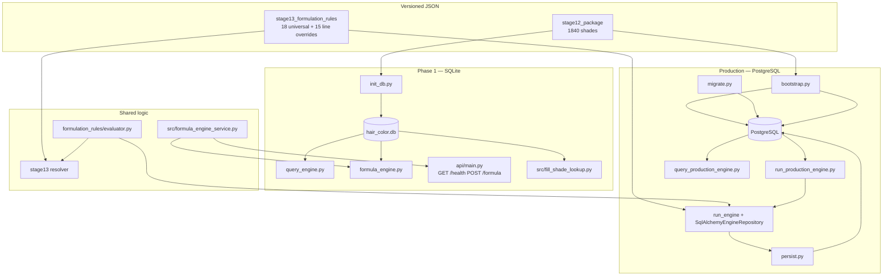

# Hair Color Formula Engine — Implementation Status

**Last updated:** 2026-06-17  
**Baseline commit:** `main` @ `c4e46c9` (PR #19 — FastAPI wrapper merged)

This document evaluates what is **done**, what is **partial**, and what **remains** to reach a production-ready salon formula recommendation service. It supersedes informal backlog notes from the integration conversation.

---

## Executive summary

The project has two runnable stacks that share Stage 13 JSON rules but use different persistence layers:

| Stack | Status | Entry points |
|-------|--------|--------------|
| **Phase 1 SQLite** | **Operational** | `init_db.py`, `query_engine.py`, `formula_engine.py`, `api/main.py` (FastAPI) |
| **Production PostgreSQL** | **CLI + tests operational; no HTTP service** | `bootstrap.py`, `run_production_engine.py`, `query_production_engine.py` |

**Core engine behavior is implemented:** Stage 13 rule resolution, deposit/fill guidance, gray developer defaults, brand line overrides, cross-engine validation, auto sub-range from shade records, inventory-backed fill shade lookup (SQLite only), and PostgreSQL shade search/matching.

**Primary gaps:** production HTTP API, PostgreSQL fill-shade enrichment parity, cross-engine status alignment (12 accepted divergences), rule/data coverage for unextracted lines (102+), and platform hardening (CI, Alembic project, gram-age module).

---

## Architecture (current)



---

## Completed work

### Stage 12 — Research data (partial inventory)

| Item | Status | Evidence |
|------|--------|----------|
| 31 lines with shade extraction | Done | `stage12_package/MANIFEST.json` |
| 1,840 normalized shade records | Done | `C_normalized_shade_records.json`, `init_db.py` verification |
| 659 tone normalization mappings | Done | `F_tone_normalization_map.json` |
| 29 line technical records | Done | `D_line_technical_records.json` |
| Batches 01–08 integrated | Done | `hair_color_db/batches/batch01` … `batch07`, Stage 5 FACTION8 records in `stage12_package/` |
| Gap / licensing reports | Done | `stage11_gaps/`, `stage12_package/I_gap_risk_licensing_report.json` |

### Stage 13 — Formulation rules

| Item | Status | Evidence |
|------|--------|----------|
| 18 universal rules (U001–U018) | Done | `B_universal_rule_library.json` |
| 15 active line override groups | Done | `D_brand_line_overrides.json` |
| 9 service workflows | Done | `C_service_workflows.json` |
| 21 validation cases (VC001–VC029 subset) | Done | `F_validation_cases.json` |
| Deterministic resolver | Done | `resolver.py` |
| Deposit/fill rules (U013–U015) | Done | gray 20 vol, deposit 10 vol, fill pigment |
| Brand gray overrides (Koleston, Topchic, IGORA, Majirel, Kenra, Colorance, Matrix collections) | Done | `D_brand_line_overrides.json` |
| Shared rule evaluator | Done | `hair_color_db/formulation_rules/evaluator.py` (PR #14) |
| Package build / emit | Done | `build.py`, `emit_artifacts.py` |

### Phase A–E integration (merged PR #15)

| Stage | Description | Key modules |
|-------|-------------|-------------|
| **B** | Stage 13 → PostgreSQL import | `import_stage13_rules.py` |
| **C** | Cross-engine validation CI | `cross_engine_validation.py`, `test_cross_engine_validation.py` |
| **D** | Stage 12 → PostgreSQL import | `import_stage12_research.py` |
| **E** | SQLite CLI convergence | `src/formula_builder.py`, `formula_engine.py`, Stage 13 overlay on primary `developer` |

### Post-integration features (PRs #16–#19)

| Feature | PR | Notes |
|---------|-----|-------|
| PostgreSQL e2e wiring | #16 | `db.py`, `migrate.py`, `bootstrap.py`, `persist.py`, `docker-compose.yml` |
| PostgreSQL shade search/matching | #17 | `shade_matching.py`, `query_production_engine.py`, `--shade-ref` |
| Auto sub-range from shade record | #18 | `src/sub_range_intake.py`; no manual `--sub-range` for collection shades |
| FastAPI over SQLite engine | #19 | `api/main.py`, `src/formula_engine_service.py` |

### SQLite CLI capabilities

- Shade search by level/tone/brand/gray (`query_engine.py`)
- Formula build with Stage 13 rules, fill guidance, inventory `suggested_shades` (`formula_engine.py`)
- Three-part shade refs `Brand::Line::Code` with line hint disambiguation
- `--sub-range` override; auto-detect when omitted
- `--existing-level`, `--desired-level`, `--service-intent`, patch test gate

### Production engine capabilities

- `run_engine()` with repository injection (in-memory + SQLAlchemy)
- Intermixing, color science, line technical defaults, risk assessments
- `persistence_payload` + `persist.py` writer for formula/steps/risks
- Fill pigment step in output (no inventory enrichment on PG path)
- Auto `selected_sub_ranges` from `SelectedShade.sub_range_name`

---

## Test coverage matrix

| Suite | Requires | Approx. tests | Command |
|-------|----------|---------------|---------|
| Production engine golden paths | nothing | ~24 | `python3 -m unittest hair_color_db.production.test_engine -v` |
| Stage 13 import rows | nothing | ~10 | `python3 -m unittest hair_color_db.production.test_import_stage13_rules -v` |
| Cross-engine validation | nothing | 3 (+20 cases) | `python3 -m unittest hair_color_db.production.test_cross_engine_validation -v` |
| Stage 13 resolver validation | nothing | 22 | `python3 hair_color_db/stage13_formulation_rules/test_stage13_validation.py` |
| Deposit/fill rules | nothing / SQLite | ~11 | `python3 -m unittest hair_color_db.stage13_formulation_rules.test_deposit_fill_rules -v` |
| Sub-range intake | nothing / SQLite | ~8 | `python3 -m unittest src.test_sub_range_intake -v` |
| Formula builder Stage 13 | `init_db.py` | ~9 | `python3 -m unittest src.test_formula_builder -v` |
| Fill shade lookup | `init_db.py` | 2 | `python3 -m unittest src.test_fill_shade_lookup -v` |
| FastAPI | `init_db.py` | 3 | `python3 -m unittest api.test_api -v` |
| PostgreSQL e2e | `DATABASE_URL` + bootstrap | 3 | `python3 -m unittest hair_color_db.production.test_pg_e2e -v` |
| PG shade matching parity | `DATABASE_URL` + SQLite | 4 | `python3 -m unittest hair_color_db.production.test_pg_shade_matching -v` |
| Stage 12 PG import | `DATABASE_URL` | 4 | `python3 -m unittest hair_color_db.production.test_import_stage12_research -v` |

**Recommended smoke (no external services):**

```bash
pip install -r requirements.txt
python3 init_db.py
PYTHONPATH=. python3 -m unittest \
  hair_color_db.production.test_engine \
  hair_color_db.production.test_cross_engine_validation \
  hair_color_db.stage13_formulation_rules.test_stage13_validation \
  src.test_formula_builder \
  api.test_api -v
```

---

## Remaining work

Work items are grouped by priority. Each includes acceptance criteria and primary touchpoints.

### Tier 1 — Production readiness & engine parity

These unblock a single production deployment path with behavior matching the SQLite reference implementation.

#### R1.1 — Production HTTP API

**Status:** Not started (FastAPI exists only for SQLite Phase 1)

**Scope:**
- Add `POST /formula` (and optionally `POST /query/shades`) backed by `run_production_engine` + `SqlAlchemyEngineRepository`
- Reuse or extend `api/schemas.py`; support `DATABASE_URL` bootstrap health check
- Optional `--persist` / consultation UUID for formula writes

**Acceptance criteria:**
- `curl` against PG-backed API returns same developer volume as `run_production_engine.py` CLI for VC024–VC029 cases
- Health endpoint reports PG connectivity and import readiness (shade count ≥ 1840)

**Depends on:** PostgreSQL bootstrap (done)

**Files:** `api/main.py`, new `api/production_routes.py` or env switch `ENGINE_BACKEND=sqlite|postgres`

---

#### R1.2 — PostgreSQL fill shade inventory enrichment

**Status:** SQLite only (`src/fill_shade_lookup.py`)

**Gap:** Production `run_engine()` emits `fill_pigment_guidance` and a fill step, but does not populate `suggested_shades` / `target_natural_shades` from catalog.

**Scope:**
- Port `lookup_fill_shades_for_level` / `lookup_natural_shades_at_level` to query PostgreSQL `shade` + tone joins (reuse `shade_matching.py` patterns)
- Call enrichment after rule evaluation in production `formula_builder.py` (mirror `src/formula_builder.py`)

**Acceptance criteria:**
- Multi-level darken case (e.g. 9→5 Matrix) returns inventory-backed shade codes in PG path matching SQLite output
- Test in `test_pg_e2e.py` or new `test_pg_fill_shade_lookup.py`

**Depends on:** Stage 12 import (done)

**Files:** `src/fill_shade_lookup.py` (extract shared query interface), `hair_color_db/production/fill_shade_lookup.py`, `hair_color_db/production/formula_builder.py`

---

#### R1.3 — Cross-engine warning → status alignment

**Status:** 12 cases documented as accepted divergence (`WARNING_ELEVATION_CASES` in `cross_engine_validation.py`)

**Issue:** Production `derive_recommendation_status()` elevates rule `warning` actions to `caution`; Stage 13 resolver leaves `ok` when only a warning fired.

**Affected cases:** VC006, VC007, VC009, VC010, VC019, VC023, VC024–VC029

**Options (pick one):**
1. **Align production** — only elevate warnings that Stage 13 also treats as caution
2. **Align Stage 13** — resolver applies same status merge as production
3. **Document-only** — update `engine_readme.md` (currently says 6 cases; code has 12) and keep divergence

**Acceptance criteria:**
- `test_cross_engine_validation` passes without `WARNING_ELEVATION_CASES` exemption list, **or** explicit policy documented in `I_integration_notes.md`
- All 21 validation cases have matching `recommendation_status` across engines

**Files:** `hair_color_db/production/safety_checks.py`, `hair_color_db/stage13_formulation_rules/resolver.py`, `cross_engine_validation.py`

---

#### R1.4 — Unified API routing (SQLite vs PostgreSQL)

**Status:** Two separate CLIs + one SQLite FastAPI app

**Scope:**
- Single FastAPI app with `ENGINE_BACKEND` env or separate routers `/v1/sqlite/*` and `/v1/production/*`
- Shared request schema where fields overlap

**Acceptance criteria:**
- One `uvicorn` process can serve either backend via configuration
- OpenAPI docs describe backend requirements

**Depends on:** R1.1

---

### Tier 2 — Rule engine completeness

#### R2.1 — G005: Pulp Riot FACTION8 line override

**Status:** Closed for representative Stage 5 FACTION8 coverage; exhaustive shade-chart expansion remains a data-backlog item.

**Gap addressed:** Permanent FACTION8 now has representative Stage 12 shade/technical data and an active Stage 13 override group for gray-coverage and High Lift guardrails.

**Scope:**
- Added override group to `D_brand_line_overrides.json`
- Added representative FACTION8 shade inventory and line technical record in Stage 12

**Acceptance criteria:**
- Validation case `VC023_pulpriot_faction8_full_white_gray` covers the permanent gray-coverage path
- Override group active (not dormant) because FACTION8 shades now exist in section C

**Depends on:** Complete shade-chart expansion remains in Tier 4 for exhaustive coverage

**Files:** `D_brand_line_overrides.json`, `F_validation_cases.json`, `emit_artifacts.py`

---

#### R2.2 — Apply `developer_override` intermixing rules

**Status:** Modeled in schema; not applied to developer selection (`engine_readme.md` known limitation)

**Scope:**
- Extend `check_intermixing` or post-rule pass to adjust developer volume/ratio when intermixing rule `restriction_type=developer_override`

**Acceptance criteria:**
- Unit test with seeded intermixing rule changes developer output
- Documented in `engine_readme.md`

**Files:** `hair_color_db/production/safety_checks.py`, `repositories.py` seed fixtures

---

#### R2.3 — Reserved validation cases

**Status:** VC002, VC014–VC018, VC020–VC022 reserved (`MANIFEST.json`)

**Scope:** Author cases when corresponding lines/batches land (e.g. Illumina, Color Fusion, additional Goldwell sub-ranges)

**Acceptance criteria:** Each new batch adds ≥1 validation case before merge

---

#### R2.4 — `formula_zones` in production output

**Status:** Resolver sets `formula_zones` for workflows like `WF_retouch_with_refresh`; production engine does not surface (`RESOLVER_ONLY_EXPECTATIONS`)

**Scope:** Map workflow-triggered zones into `EngineOutput` or `SuggestedFormulaStep.zone` assignments

**Acceptance criteria:** Cross-engine test removes `formula_zones` from resolver-only set for retouch workflow case

---

### Tier 3 — Platform, schema & operations

#### R3.1 — CI test pipeline

**Status:** No `.github/workflows`

**Scope:**
- Job 1: `pip install -r requirements.txt && python3 init_db.py && unittest` (SQLite suites)
- Job 2 (optional): Postgres service container, `bootstrap`, PG e2e tests
- Job 3: `python3 hair_color_db/stage13_formulation_rules/build.py` + validation tests

**Acceptance criteria:** PR checks run on push; badge in README optional

---

#### R3.2 — Alembic project (replace manual migration runner)

**Status:** Revision modules exist as copy-paste artifacts; `migrate.py` runs SQL files with `schema_migration` table

**Scope:**
- Add `alembic.ini`, `alembic/env.py` pointing at existing revisions
- Keep `bootstrap.py` calling Alembic upgrade head

**Acceptance criteria:** Fresh DB via `alembic upgrade head` equivalent to current `migrate.py` + seeds

**Files:** `hair_color_db/production/alembic_revision*.py`, new `alembic/` directory

---

#### R3.3 — Gram-age / quantity module

**Status:** 60g placeholders everywhere (`engine_readme.md`)

**Scope:** Replace fixed `quantity_grams` with hair-length or stylist-input-driven defaults

**Acceptance criteria:** Formula steps include documented quantity rationale; tests for at least short/medium/long hair

---

#### R3.4 — Consultation / auth layer

**Status:** `persist.py` creates stub consultations with `SYSTEM_STYLIST_ID`

**Scope:** Auth middleware, real stylist/salon IDs, consultation lifecycle before formula persist

**Depends on:** R1.1 production API

---

#### R3.5 — Schema extension H — evidence tables

**Status:** Proposed in `H_schema_extension_proposal.json`; partial (workflows + validation_case imported; `formulation_rule_evidence` not wired)

**Scope:** Import evidence links from Stage 13 package; expose in rule audit trail

---

### Tier 4 — Data acquisition backlog

Not blocking engine runtime for **currently extracted** 31 lines, but limits brand coverage and dormant override activation.

| Metric | Count | Source |
|--------|-------|--------|
| Lines inventoried | 133 | Stage 1 |
| Lines with shade extraction | 31 | Stage 12 MANIFEST |
| Lines queued (gaps) | 102+ | `stage11_gaps/gap_risk_report.json` |
| Formulation gaps | 0 active G005 blockers; gap artifact retained for historical tracking | `G_conflicts_and_gaps.json` |

**High-value extraction targets** (examples from gap reports):
- Pulp Riot FACTION8 exhaustive shade-chart expansion, Liquid Demi, Lighteners
- Redken Color Fusion, Shades EQ Cream
- Wella Illumina, Blondor lighteners
- Schwarzkopf IGORA variants beyond ROYAL/VIBRANCE

**Process per batch:** Stages 4–9 tools → integrate into `stage12_package` → `init_db.py` / PG import → new line overrides + validation cases.

---

## Doc & code hygiene (quick fixes)

| Item | Location | Fix |
|------|----------|-----|
| Stale shade count in init header | `init_db.py` | Update 1,479 → 1,840 |
| Warning divergence count | `engine_readme.md` | 6 → 12 cases or link to `WARNING_ELEVATION_CASES` |
| I_integration_notes case count | says 14 cases | Update to 21 |
| Root README line count | says 26 lines | MANIFEST says 31 with extraction |
| Stage 13 universal rule range in I_integration_notes | U001–U012 | U001–U015 |

---

## Recommended implementation sequence

For a **production MVP** (salon-facing API on PostgreSQL with parity to SQLite CLI):

```
1. R1.2  PG fill shade enrichment          ← closes largest behavior gap
2. R1.3  Cross-engine status alignment     ← single rule semantics
3. R1.1  Production HTTP API             ← deployable surface
4. R1.4  Unified API routing               ← one service, two backends optional
5. R3.1  CI pipeline                       ← regression safety
6. R2.2  developer_override intermixing    ← edge-case correctness
7. R3.2  Alembic project                   ← ops maturity
```

For **coverage expansion** (parallel track):

```
T4 batches → FACTION8 exhaustive shade-chart expansion / next priority lines → R2.3 new validation cases
```

---

## Reference — merged PR history

| PR | Feature |
|----|---------|
| #14 | Shared rule evaluator |
| #15 | Integration stack (Stages B–E, deposit/fill, `--sub-range`) |
| #16 | PostgreSQL e2e wiring |
| #17 | PostgreSQL shade search/matching |
| #18 | Auto sub-range from shade record |
| #19 | FastAPI over SQLite formula engine |

---

## Related documents

| Document | Path |
|----------|------|
| Data acquisition overview | `hair_color_db/README.md` |
| Production engine design | `hair_color_db/production/engine_readme.md` |
| Research vs production schema | `hair_color_db/production/research_vs_production_schema.md` |
| Stage 13 integration notes | `hair_color_db/stage13_formulation_rules/I_integration_notes.md` |
| Stage 12 package manifest | `hair_color_db/stage12_package/MANIFEST.json` |
| Stage 13 package manifest | `hair_color_db/stage13_formulation_rules/MANIFEST.json` |
| Formulation gaps | `hair_color_db/stage13_formulation_rules/G_conflicts_and_gaps.json` |
| Local PostgreSQL setup | `.env.example`, `docker-compose.yml` |
