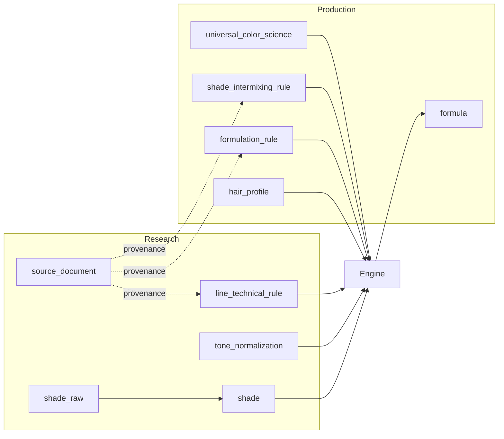

# Research vs Production Schema

## Assumptions

- The **research layer** (18 tables from `stage12_package/H_schema_proposal.json`) is deployed first with **UUID** primary keys on all canonical entities (`brand_id`, `line_id`, `shade_id`, etc.).
- Research ingest populates `shade_raw` (append-only), rebuilds `shade`, and loads `line_technical_rule` rows split from Stage 5 JSON.
- `sub_range` rows exist before shade uniqueness is enforced (`UNIQUE(line_region_id, sub_range_id, shade_code)`).
- Operational seeds that reference Matrix SoColor sub-ranges run only when matching research data is present; missing rows are skipped safely.
- `client_id`, `stylist_id`, `salon_id`, and `formula_outcome.reported_by` are **external identity UUIDs** without FK enforcement (salon/stylist SaaS identities live outside this database).

## Responsibilities

| Layer | Role | Mutability |
|---|---|---|
| **Research DB** | Source-traceable manufacturer facts: brands, lines, shades, tone maps, line technical rules, provenance | Append-only raw (`shade_raw`); normalized tables rebuilt deterministically from raw + mappings |
| **Production DB** | Same PostgreSQL database (or read replica) with **additive operational tables** for the deterministic formula engine and PRD workflow | Operational tables are transactional; research facts are read, not overwritten |

The production layer does **not** replace or redesign the research schema. It reads research facts and adds:

1. **Universal color science** — brand-agnostic lift/neutralization reference (levels 1–12).
2. **Typed facets on `line_technical_rule`** — queryable columns alongside preserved `rule_value` JSON.
3. **`shade_intermixing_rule`** — compact safety/compatibility rules (sub-range scoped where needed).
4. **`formulation_rule`** + **`formulation_rule_brand`** / **`formulation_rule_line`** — engine condition/action rules with join-table applicability (no UUID[] FK arrays).
5. **PRD domain tables** — `consultation`, `hair_profile`, `formula`, `formula_step`, `risk_assessment`, `formula_outcome`.

## Why the research layer stays append-only

Manufacturer extractions are evidence-bearing artifacts. Overwriting raw wording would destroy auditability and make re-normalization non-reproducible. The research pipeline therefore:

- Appends new `shade_raw` rows per `ingestion_run`.
- Versions changes through `record_version`.
- Stores conflicts as additional `record_source` rows plus `issue_log` entries.

The formula engine **reads** normalized `shade` rows and `line_technical_rule` facts; it never writes back to research tables during a consultation.

## How data feeds the deterministic engine



1. **`hair_profile`** captures consultation intake (levels, porosity, gray %, chemical history).
2. **`universal_color_science`** supplies underlying pigment and neutralizing tone by level for lift/neutralization math.
3. **`line_technical_rule`** provides line/sub-range defaults (developer volume, mixing ratio, processing time, gray coverage); typed columns are preferred when populated, with JSON fallback.
4. **`shade_intermixing_rule`** filters invalid shade/sub-range combinations before steps are assembled.
5. **`formulation_rule`** applies prioritized condition/action JSON (developer adjustments, workflows, risk modifiers) scoped by brand/line join tables.
6. Output is persisted as **`formula`** + **`formula_step`** + **`risk_assessment`**; post-service feedback goes to **`formula_outcome`**.

## Applicability semantics (`formulation_rule`)

| `formulation_rule_brand` | `formulation_rule_line` | Meaning |
|---|---|---|
| empty | empty | Universal rule |
| rows present | empty | All lines for listed brands |
| rows present | rows present | Only listed lines (lines must belong to scoped brands in application logic) |

Brand/line scope uses **join tables**, not PostgreSQL UUID arrays, so FK integrity and index-friendly filtering are preserved.

## Intermixing rule scopes (`shade_intermixing_rule`)

| `rule_scope` | Meaning |
|---|---|
| `sub_range_isolated_from_line` | Shades in `applies_to_sub_range_id` cannot mix with any other sub-range in the line (HD, Ultra Blonde) |
| `sub_range_internal_only` | Mixing allowed only within the same sub-range (SoColor 10 min) |
| `cross_sub_range` | Pairwise or caution between sub-ranges (Extra Coverage + Blended/Reflect; DreamAge vs non-DreamAge) |
| `shade_pair` | Explicit shade-level exception |

## Deviations from the original spec

| Topic | Spec / request | Implementation | Reason |
|---|---|---|---|
| Brand/line applicability | UUID[] FK arrays | `formulation_rule_brand` + `formulation_rule_line` join tables | PostgreSQL cannot enforce UUID[] FK arrays; join tables are production-safe |
| `shade_intermixing_rule` compact modeling | Pair-only rows | Added `rule_scope` enum + `line_region_id` | Avoids thousands of shade-pair seeds for line-wide restrictions |
| `consultation` identity FKs | UUID FK | UUID columns without FK | External stylist/salon/client services are out of scope for this schema |
| `confidence` on `universal_color_science` | ENUM name `confidence` | PostgreSQL type `color_science_confidence` | Avoids collision with research `source_confidence` enum |
| Intermixing seed `source_id` | NOT NULL FK | Resolved via `source_document` title lookup (`%2023 Matrix Manual%`) | Deterministic link to existing catalog row when research DB is loaded |
| `line_technical_rule` backfill | Migrate JSON → typed columns | Python parser in Alembic; skips ambiguous JSON | Never coerces ambiguous values; `rule_value` always preserved |

## File layout

```
hair_color_db/production/
  production_operational_schema.sql   # Standalone DDL + seeds
  production_models.py                # SQLAlchemy 2.0 ORM
  production_schemas.py               # Pydantic v2 Create/Update/Response
  alembic_revision.py                 # Migration (upgrade + downgrade + backfill)
  research_vs_production_schema.md    # This document
```

## Applying the migration

1. Deploy research baseline DDL (from `H_schema_proposal.json` — separate migration `research_baseline`).
2. Copy `alembic_revision.py` into your Alembic versions directory or run `production_operational_schema.sql` directly.
3. Re-run research ingest after mapping changes; operational seeds for Matrix intermixing rules require `sub_range` names matching ingest (`HD`, `Ultra Blonde`, `Extra Coverage`, `Blended`, `Reflect`, `DreamAge`, `SoColor 10 min`).

## `line_technical_rule` backfill (recognized JSON)

The Alembic revision backfills typed columns only when `rule_value` matches deterministic shapes documented in `alembic_revision.py` module docstring (`developer`, `mixing_ratio`, `processing_time`, `gray_coverage`, `lift`). Unparseable or ambiguous JSON is skipped without failing the migration.
